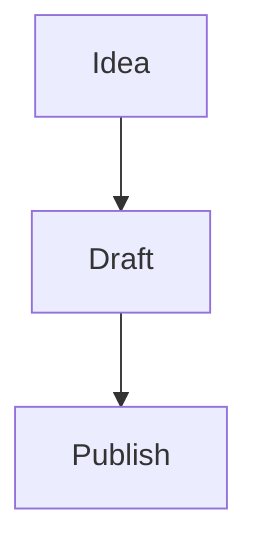

# Markdown Portfolio

A static portfolio, blog, projects, experience, and playlist site powered by markdown files.

Live site: https://karam-portfolio-template.pages.dev/

Source repository: https://github.com/kachhadiyaraj15/karam-portfolio-template

The main idea is simple: edit markdown source files, run the build command, and the site generates static JSON and HTML-ready data for the frontend.

## Quick start

Prerequisites:

- Node.js, for running the static content generator
- npm, for installing the build-time markdown renderer dependencies
- Python 3, for the local preview server

Install dependencies once after cloning:

```bash
npm install
```

Markdown is rendered during `npm run build`. The generated `api-static/` JSON contains HTML-ready content for blog posts, projects, experience, home, about, playlists, and note embeds. The browser no longer loads markdown parser or syntax-highlight JavaScript packages; Mermaid JavaScript still runs in the browser to draw generated Mermaid diagram blocks.

Start the local site:

```bash
npm run dev
```

`npm run dev` rebuilds the markdown content first, then starts the local server at:

```text
http://localhost:8000
```

Only rebuild generated content:

```bash
npm run build
```

Build the deployable static folder:

```bash
npm run build:pages
```

This creates `dist/`, which is the folder Cloudflare Pages or Wrangler should publish.

Start the preview server without rebuilding:

```bash
npm run serve
```

## Source files

Edit these files and folders:

- `config/site.md`: site name, tagline, navigation, footer, feature toggles
- `config/images.md`: reusable image variables
- `home/home.md`: homepage content and homepage social links
- `about/about.md`: about page content and about page social links
- `projects/tech/*.md`: technical project cards and project detail pages
- `projects/non-tech/*.md`: non-technical project cards and project detail pages
- `blog/tech/*.md`: technical blog posts
- `blog/non-tech/*.md`: non-technical blog posts
- `experience/**/*.md`: experience entries
- `playlists/*.md`: playlist definitions
- `assets/`: images and other static media

Generated files:

- `api-static/`
- `dist/`, when you run `npm run build:pages`
- top-level generated HTML shell updates

Do not edit `api-static/` manually. It is rebuilt from markdown by `npm run build`.
Do not edit `dist/` manually. It is rebuilt by `npm run build:pages`.

## Normal editing workflow

1. Edit the markdown file you want to change.
2. Install dependencies if this is a fresh clone:

```bash
npm install
```

3. Run:

```bash
npm run build
```

4. Refresh the local site.
5. Commit both the source markdown changes and generated files.

Common changes:

- Homepage text: `home/home.md`
- About page: `about/about.md`
- Site name, footer, feature toggles: `config/site.md`
- Social links: `home/home.md` and `about/about.md`
- Project image variables: `config/images.md`
- New project: add a markdown file in `projects/tech/` or `projects/non-tech/`
- New blog post: add a markdown file in `blog/tech/` or `blog/non-tech/`
- New experience: add a markdown file in `experience/Full Time/`, `experience/Internship/`, or another experience folder
- New playlist: add a markdown file in `playlists/`

## Site configuration

Main configuration lives in `config/site.md`.

Example:

```md
site_name: Your Name
site_tagline: Product-minded software engineer
site_description: A short description of the site.
site_url: https://karam-portfolio-template.pages.dev
seo_image: assets/images/project1.jpg
seo_locale: en_US

enable_home: true
enable_about: true
enable_projects: true
enable_blog: true
enable_playlists: true
enable_experience: true

feature_theme_toggle: true
feature_blog_filters: true
feature_project_tags: true
feature_social_links: true

source_code_github_icon: true
source_code_github_url: https://github.com/your-user/your-repo
source_code_github_label: Source code
```

After changing config, run:

```bash
npm run build
```

## SEO

The build generates SEO tags for the HTML shells and detail pages:

- page titles and meta descriptions
- canonical URLs
- Open Graph and Twitter preview tags
- JSON-LD structured data for the site, person, blog, collections, and detail pages
- `sitemap.xml`
- `robots.txt`

Set the production URL before publishing:

```md
site_url: https://karam-portfolio-template.pages.dev
```

Without `site_url`, the local site still works, but generated sitemap and canonical URLs cannot point to your real production domain.
On Cloudflare Pages, the build can fall back to `CF_PAGES_URL`; still set `site_url` when you connect a custom domain.

Set the default social preview image:

```md
seo_image: assets/images/project1.jpg
```

For stronger search snippets, keep these fields specific:

- `site_description` in `config/site.md`
- `excerpt` in each blog post
- `description` in each project, playlist, and experience entry
- `tags` and `category` in blog posts

After changing SEO config or content, run:

```bash
npm run build
```

## Navigation

Navigation is controlled by the `navigation` field in `config/site.md`.

```md
navigation: home|Home|index.html, experience|Experience|experience.html, projects|Projects|projects.html, blog|Blog|blog.html, playlists|Playlists|playlists.html, about|About|about.html
```

Format:

```text
page_key|Visible Label|target-file.html
```

If a page is disabled with `enable_*: false`, it is hidden from navigation even if it remains in the `navigation` list.

## Source Code GitHub Icon

The header can show an icon-only GitHub link for the source repository. This is separate from `social_github`, so changing it does not affect homepage or about page social links.

Configure it in `config/site.md`:

```md
source_code_github_icon: true
source_code_github_url: https://github.com/kachhadiyaraj15/karam-portfolio-template
source_code_github_label: Source code
```

Set the toggle to `false` to hide the icon:

```md
source_code_github_icon: false
```

Rebuild after changing it:

```bash
npm run build
```

## Turning Playlists On Or Off

Playlist visibility is controlled in `config/site.md`.

Turn playlists on:

```md
enable_playlists: true
```

Make sure the navigation contains:

```md
playlists|Playlists|playlists.html
```

Turn playlists off:

```md
enable_playlists: false
```

When playlists are off, the Playlists nav item is hidden and direct access to playlist pages is blocked by the frontend.

Rebuild after changing the toggle:

```bash
npm run build
```

## Homepage

Homepage source:

```text
home/home.md
```

Supported frontmatter:

```md
---
name: Your Name
title: One-line headline
bio: Short homepage bio
twitter: https://x.com/your_handle
twitter_label: Your X Profile
github: https://github.com/your-user
github_label: Your GitHub
linkedin: https://www.linkedin.com/in/your-profile/
linkedin_label: Your LinkedIn
youtube: https://www.youtube.com/@your-channel
youtube_label: Your YouTube
email: hello@example.com
email_label: Work Email
website: https://example.com
website_label: Portfolio
---
```

The markdown body below the frontmatter becomes the homepage content.

## About Page

About source:

```text
about/about.md
```

Supported frontmatter:

```md
---
name: Your Name
tagline: Your role or positioning
location: City, Country
email: hello@example.com
email_label: Work Email
twitter: https://x.com/your_handle
twitter_label: Your X Profile
github: https://github.com/your-user
github_label: Your GitHub
linkedin: https://www.linkedin.com/in/your-profile/
linkedin_label: Your LinkedIn
website: https://example.com
website_label: Portfolio
focus: [Frontend systems, Product engineering, Content workflows]
availability: Open to selected projects
---
```

Leave any optional value blank if you do not want it to appear.

## Social Links And Labels

Social links are picked up automatically from these fields:

- `twitter`
- `github`
- `linkedin`
- `youtube`
- `email`
- `website`

If only the URL is provided, the UI infers a visible name from the URL.

Example:

```md
twitter: https://x.com/karam_demo
linkedin: https://www.linkedin.com/in/karam-demo/
email: karam.demo@example.com
```

This can display as:

```text
@karam_demo
karam-demo
karam.demo
```

To control the visible label yourself, add the matching `*_label` field:

```md
twitter: https://x.com/your_handle
twitter_label: My X Profile

github: https://github.com/your-user
github_label: My GitHub

linkedin: https://www.linkedin.com/in/your-profile/
linkedin_label: My LinkedIn

youtube: https://www.youtube.com/@your-channel
youtube_label: My YouTube

email: hello@example.com
email_label: Work Email

website: https://example.com
website_label: Portfolio
```

The URL decides where the button opens. The label decides what text appears in the UI.

To hide a social link, leave its URL blank:

```md
github:
github_label:
```

To hide all social links globally:

```md
feature_social_links: false
```

## Projects

Project files live in:

```text
projects/tech/
projects/non-tech/
```

Create one markdown file per project.

Supported frontmatter:

```md
---
title: Project title
description: Short project summary
image: {{PROJECT1_IMAGE}}
technologies: [React, Node, Design Systems]
githubUrl: https://github.com/user/project
liveUrl: https://project.example.com
demoUrl: https://demo.example.com
links: [Docs|https://docs.example.com, Live Preview|https://demo.example.com]
published: true
featured: false
date: 2026-01-01
---
```

Notes:

- `published: false` hides the project.
- `featured: true` can be used for highlighted projects.
- `image` can use a direct path or an image variable from `config/images.md`.
- `links` adds extra project buttons. Use `Label|URL`, separated by commas inside `[ ]`. External links open in a new tab; internal links can use paths like `/blog-post/post-id/` or `project-detail/project-id/`.
- The markdown body becomes the project detail page.

## Blog Posts

Blog files live in:

```text
blog/tech/
blog/non-tech/
```

Supported frontmatter:

```md
---
title: Article title
date: 2026-01-01
published: true
tags: [Engineering, Systems, Writing]
excerpt: Short summary for the blog list.
readingTime: 6 min read
---
```

Notes:

- `published: false` hides the post.
- The filename is used as the blog id.
- Example: `markdown-ui-stress-test.md` becomes `markdown-ui-stress-test`.
- Blog detail URL format:

```text
blog-post.html?id=markdown-ui-stress-test
```

## Playlists

Playlist files live in:

```text
playlists/
```

Supported frontmatter:

```md
---
title: Frontend Polish Series
description: A curated reading path for frontend posts.
cover: assets/images/project1.jpg
order: 10
posts: [markdown-ui-stress-test, getting-started-with-web-development]
published: true
---
```

The `posts` list must contain blog ids. A blog id usually matches the markdown filename without `.md`.

Example:

```text
blog/tech/understanding-async-javascript.md
```

Blog id:

```text
understanding-async-javascript
```

Playlist behavior:

- `playlists.html` shows playlist cards.
- `playlist-detail.html?id=playlist-id` shows all posts in that playlist.
- When a blog post is opened from a playlist, previous and next links follow that playlist order.
- `order` controls playlist sorting.
- `published: false` hides the playlist.

## Experience

Experience files live in:

```text
experience/
```

You can organize them by folder, for example:

```text
experience/Full Time/
experience/Internship/
```

Supported frontmatter:

```md
---
company: Company Name
role: Role Title
description: Short summary for the experience card.
employmentType: Full Time
location: City, Country
startDate: 2026-01
endDate: 2026-12
current: false
published: true
featured: false
order: 100
website: https://example.com
technologies: [Leadership, Product, Engineering]
---
```

Notes:

- `current: true` marks the role as ongoing.
- `published: false` hides the entry.
- `order` controls manual sorting.
- The markdown body becomes the experience detail page.

## Images

Static assets can live in:

```text
assets/
```

Use a direct image path:

```md

```

Or define reusable image variables in `config/images.md`:

```md
PROJECT1_IMAGE: assets/images/project1.jpg
BLOG_HERO: assets/images/blog-hero.jpg
```

Then use:

```md

```

Supported image formats:

- `png`
- `jpg`
- `jpeg`
- `gif`
- `webp`
- `svg`
- `avif`

## Markdown Features

The renderer supports standard markdown plus richer writing features.

### Headings

```md
# H1
## H2
### H3
#### H4
```

### Emphasis

```md
**bold**
*italic*
***bold italic***
~~strikethrough~~
==highlighted==
```

### Links

```md
[External link](https://example.com)

[Reference link][docs]

[docs]: https://example.com/docs
```

Plain URLs also render as links:

```md
https://example.com
```

### Lists

```md
- bullet
- bullet
  - nested bullet

1. ordered
2. ordered
   1. nested ordered

- [x] completed task
- [ ] pending task
```

### Code

Inline code:

```md
`const value = 1`
```

Code block:

````md
```javascript
function greet() {
  console.log("hello");
}
```
````

### Tables

```md
| Name | Role | Score |
|:-----|:----:|------:|
| Karam | Dev | 10 |
| Team | Ops | 8 |
```

### Quotes And Rules

```md
> This is a blockquote

---
```

### Footnotes

```md
Sentence with a footnote.[^1]

[^1]: Footnote text
```

### Definition Lists

```md
Markdown
: A lightweight markup language
```

### Math

Inline math:

```md
$E = mc^2$
```

Block math:

```md
$$
a^2 + b^2 = c^2
$$
```

### Mermaid Diagrams

Use Mermaid fences:

````md

````

Mermaid is rendered on the frontend. If a diagram appears too large, simplify the graph labels or split a large diagram into smaller diagrams.

### Raw HTML

Simple HTML is supported:

```md
<u>Underlined text</u>

<details>
<summary>Click to expand</summary>

Hidden content

</details>
```

### Comments

Obsidian-style comments are removed from rendered output:

```md
%% this comment is hidden %%
```

## Obsidian-Style Links And Embeds

Internal note links:

```md
[[Another Note]]
[[Another Note|Custom label]]
[[Another Note#Heading]]
[[Another Note#^blockID]]
```

Block IDs:

```md
Important sentence here ^blockID
```

Note embeds:

```md
![[Another Note]]
![[Another Note#Heading]]
![[Another Note#^blockID]]
```

Image embeds:

```md
![[image.png]]
![[image.png|300]]
![[image.png|300x200]]
```

File embeds:

```md
![[file.pdf]]
![[audio.mp3]]
![[video.mp4]]
```

Embeds work best when the target note or file exists inside the project content.

## Callouts

Supported callouts:

```md
> [!note]
> General note

> [!tip]
> Helpful advice

> [!warning]
> Important caution

> [!danger]
> Risk or failure state

> [!success]
> Positive result
```

Foldable callout:

```md
> [!note]- Collapsible title
> Hidden content
```

## Tags

Inline tags are supported:

```md
#tag
#project/frontend
```

## Personal Information Checklist

Before publishing, check these files:

- `config/site.md`
- `home/home.md`
- `about/about.md`
- `experience/**/*.md`
- `projects/**/*.md`
- `blog/**/*.md`

Look for:

- placeholder names
- demo email addresses
- demo social links
- personal locations
- private company names
- unpublished project details

Search examples:

```bash
rg "karam-demo|karam_demo|example.com|@example.com|Bengaluru"
```

After removing or changing personal details:

```bash
npm run build
```

## Deployment

This site can be deployed to static hosting.

Recommended Vercel settings:

- Install Command: `npm install`
- Build Command: `npm run build`
- Output Directory: `.`

Recommended Cloudflare Pages settings:

- Install Command: `npm ci`
- Build Command: `npm run build:pages`
- Build Output Directory: `dist`
- Deploy Command: leave blank

For custom domains, add this environment variable or set the same value in `config/site.md`:

```text
SITE_URL=https://your-domain.com
```

Do not set the Cloudflare deploy command to `npx wrangler deploy` for a Pages project. If Wrangler deploys the repository root, it can try to upload `node_modules/` as public assets and fail on large internal binaries. This template includes `wrangler.jsonc` for direct Wrangler deploys, and it points assets at `./dist`.

General deployment workflow:

1. Edit markdown.
2. Run `npm install` if dependencies are not installed yet.
3. Set `site_url` in `config/site.md` to the final production URL. This project currently uses `https://karam-portfolio-template.pages.dev`.
4. Run `npm run build` for normal generated content, or `npm run build:pages` when publishing from `dist`.
5. Test locally with `npm run serve` or `npm run dev`.
6. Push to your Git provider.
7. Let the hosting provider deploy the static files.

For hosts that do not run builds, commit the generated `api-static/` files and generated shell updates after `npm run build`. For hosts that run builds, the source markdown and `package-lock.json` are enough for the provider to regenerate the static output.

After production is live, submit `https://karam-portfolio-template.pages.dev/sitemap.xml` in Google Search Console or the search console for the engine you care about.

## Troubleshooting

If content does not update:

```bash
npm run build
```

Then hard refresh the browser.

If a social link does not appear, check that the URL field is not blank:

```md
github: https://github.com/your-user
github_label: Your GitHub
```

If playlists do not appear, check:

```md
enable_playlists: true
```

And confirm the playlist has:

```md
published: true
posts: [valid-blog-id]
```

If a blog post does not appear, check:

```md
published: true
```

If an image does not appear:

- confirm the file exists
- confirm the path starts from the project root, such as `assets/images/image.jpg`
- run `npm run build`

## Important Rules

- Edit markdown source files, not generated JSON.
- Run `npm run build` after content or config changes.
- Keep filenames stable if playlists link to those blog ids.
- Leave optional frontmatter fields blank to hide them.
- Use `*_label` fields when you want custom social button text.
