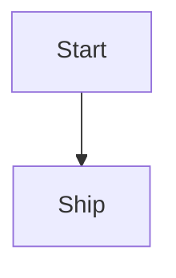

## Context

Explain the question, situation, or problem that made this note worth writing.

## Key idea

Write the main argument early.

## Standard markdown you can use

### Headings

Use `##` and `###` headings in note content.

```markdown
## Section heading
### Subsection heading
#### Smaller heading
```

### Emphasis

```markdown
**bold**
*italic*
***bold italic***
~~strikethrough~~
==highlighted==
```

### Links

```markdown
[External link](https://example.com)
[Reference link][docs]

[docs]: https://example.com/docs
```

Plain URLs also render as links:

```markdown
https://example.com
```

### Lists

```markdown
- bullet
- bullet
  - nested bullet

1. ordered
2. ordered
   1. nested ordered

- [x] completed task
- [ ] pending task
```

### Code

Inline code:

```markdown
`const value = 1`
```

Code block:

````markdown
```javascript
function greet() {
  console.log("hello");
}
```
````

### Quotes and rules

```markdown
> This is a blockquote

---
***
___
```

### Tables

```markdown
| Name | Role | Score |
|:-----|:----:|------:|
| Karam | Dev | 10 |
| Team | Ops | 8 |
```

### Footnotes

```markdown
Sentence with note.[^1]

[^1]: Footnote text
```

### Definition lists

```markdown
Markdown
: A lightweight markup language
```

### Math

Inline math:

```markdown
$E = mc^2$
```

Block math:

```markdown
$$
a^2 + b^2 = c^2
$$
```

### Mermaid diagrams

````markdown

````

### Raw HTML

```markdown
<u>Underline with HTML</u>

<details>
<summary>Click to expand</summary>

Hidden content

</details>
```

### Comments

This is removed from rendered output:

```markdown
%% this is a hidden comment %%
```

## Images and file embeds

### Standard markdown images

1. Add the file inside `assets/images/`
2. Optionally define a variable in `config/images.md`
3. Use the image in the article body

Direct path:

```markdown

```

Using an image variable:

```markdown

```

Supported image formats in the site renderer:

- `png`
- `jpg`
- `jpeg`
- `gif`
- `webp`
- `svg`
- `avif`

### Obsidian-style image embeds

```markdown
![[image.png]]
![[image.png|300]]
![[image.png|300x200]]
```

### Other file embeds

```markdown
![[file.pdf]]
![[audio.mp3]]
![[video.mp4]]
```

## Obsidian-style links and embeds

### Internal note links

```markdown
[[Another Note]]
[[Another Note|Custom label]]
[[Another Note#Heading]]
[[Another Note#^blockID]]
```

### Block IDs

```markdown
Important sentence here ^blockID
```

### Note embeds

```markdown
![[Another Note]]
![[Another Note#Heading]]
![[Another Note#^blockID]]
```

## Callouts

```markdown
> [!note]
> A normal callout

> [!tip]
> Helpful advice

> [!warning]
> Important caution

> [!danger]
> Risk or failure state

> [!success]
> Positive result
```

Foldable callout:

```markdown
> [!note]- Collapsible title
> Hidden content
```

## Tags

Inline tags are supported too:

```markdown
#tag
#project/python
```

## Extra notes

- The blog list page does not show a separate thumbnail automatically; images render inside the blog post body.
- Underline is not native markdown; use raw HTML like `<u>text</u>`.
- Wikilinks and embeds work best when the target note exists in the project content.

## Closing thought

End with the practical takeaway.
