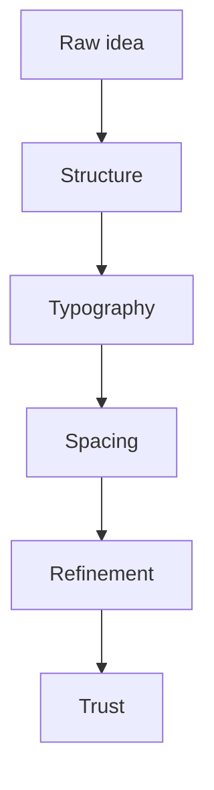

%% This comment should never appear in the rendered page. %%

This note exists to test how the website handles a long, varied piece of writing. It is intentionally mixed: some sections read like an essay, some read like documentation, and some are pure rendering checks.

If the UI is working properly, this page should make it obvious where spacing, type scale, code styling, table handling, and panel treatments still need refinement.

---

## Why this exists

Most portfolio/blog systems look fine with only one kind of content. They start to break when a page includes:

* short and long paragraphs
* nested lists
* code blocks
* tables
* images
* embeds
* diagrams
* special markdown syntax

That is why this article is intentionally dense. It is less about the writing itself and more about how the writing **behaves** in the UI.

## Basic typography checks

This sentence includes **bold text**, *italic text*, ***bold italic text***, `inline code`, and ~~struck text~~ in the same paragraph.

Escaped markdown should not format: \*this should not become italic\* and \#this should not become a heading.

Highlight should work as ==marked text==, superscript should work like 2^10^, and subscript should work like H~2~O.

Here is a forced line break at the end of this sentence.  
This line should appear directly under the previous one.

### A smaller heading

The smaller heading should still be readable without feeling too loud. A page feels professional when it handles the quiet parts of the hierarchy well, not just the large titles.

## Lists

### Unordered

* One simple bullet
* Another bullet with **emphasis**
* A bullet with a nested list
  * Nested child one
  * Nested child two with `inline code`
  * Nested child three with a [normal link](https://example.com)

### Ordered

1. Start with the obvious thing.
2. Reduce ambiguity before adding polish.
3. Make the common path feel natural.
4. Then handle the uncomfortable edge cases.

### Task list

- [x] Heading hierarchy
- [x] Paragraph spacing
- [x] Image rendering
- [x] Link styling
- [ ] Final visual QA on a real phone

## Links

Normal link: [OpenAI](https://openai.com)

Reference link: [Vercel docs][vercel]

Auto URL: https://developer.mozilla.org/

Obsidian-style internal links:

* [[about]]
* [[home]]
* [[Portfolio Publishing System]]
* [[about#What I bring]]

[vercel]: https://vercel.com/docs

## Blockquote and callouts

> Good UI often comes from reducing friction, not adding novelty.
>
> A clean reading layout should help content feel more trustworthy.

> [!note]
> This is a note callout. It should look different from plain prose.

> [!tip]
> This is a tip callout. The tone should feel lighter but still distinct.

> [!warning]
> This is a warning callout. It should not disappear into the background.

> [!danger]- Collapsible risk note
> This callout is foldable.
>
> If the UI is working, it should feel like a proper collapsible block rather than broken quoted text.

## Definition list

Editorial rhythm
: The spacing and hierarchy that make a page feel intentional instead of accidental.

Surface treatment
: The way cards, panels, lines, and shadows help separate content without overwhelming it.

## Tables

| Item | Why it matters | Status |
|------|----------------|--------|
| Headings | They control scanning and hierarchy | Good |
| Lists | They expose spacing problems quickly | Good |
| Tables | They reveal overflow and small-screen issues | Check |

| Left | Center | Right |
|:-----|:------:|------:|
| calm | balanced | aligned |
| soft | even | sharp |

## Images

Below is a normal markdown image using an existing site asset. It should resize correctly and stay inside the content width.


This next line uses raw HTML for underline and a caption-like treatment: <u>visual regression checks are easier when content varies on purpose</u>.

## Code

Inline code should feel different from fenced code. A fence should have clear padding, readable token colors, and no overflow bugs.

```javascript
function auditLayout(sectionName, issues) {
    return {
        sectionName,
        issues,
        passed: issues.length === 0,
        checkedAt: new Date().toISOString()
    };
}

const report = auditLayout('blog-post', ['toc overlap', 'chip contrast']);
console.log(report);
```

```css
.reading-column {
    max-width: 72ch;
    margin-inline: auto;
}

.reading-column img {
    max-width: 100%;
    height: auto;
}
```

```json
{
  "component": "about-page",
  "focus": ["hierarchy", "spacing", "contrast"],
  "ready": false
}
```

## Horizontal rhythm

The page should be able to move from paragraph, to list, to code, to callout, to image without feeling like five different templates were stitched together.

---

## HTML details block

<details>
<summary>Open a native HTML details block</summary>

This content uses raw HTML and should still inherit the site styling in a clean way.

It is useful for FAQs, side notes, and optional detail that would otherwise crowd the main reading flow.

</details>

## Footnotes

Good writing systems let supporting detail sit nearby without interrupting the main thought.[^footnote-one]

Another statement can point somewhere else.[^footnote-two]

[^footnote-one]: This is the first footnote. It should render in a styled footnotes section.
[^footnote-two]: This is the second footnote. The return/back references should also work.

## Math

Inline math should render like $E = mc^2$ inside a sentence.

Block math should render with better separation:

$$
\text{clarity} = \frac{\text{signal}}{\text{noise}}
$$

## Mermaid



## Plugin-style fences

```dataview
TABLE file.name, tags
FROM #markdown
```

```chart
type: bar
labels: [Readability, Contrast, Rhythm]
series:
  - title: Score
    data: [8, 7, 9]
```

```chart
type: line
labels: [Draft, Review, Polish, Publish]
series:
  - title: Confidence
    data: [3, 5, 7, 9]
```

```chart
type: pie
labels: [Writing, Visual QA, Testing]
series:
  - title: Allocation
    data: [45, 30, 25]
```

```chart
type: doughnut
labels: [Calm, Clarity, Consistency, Trust]
series:
  - title: Design Values
    data: [30, 28, 22, 20]
```

```chart
type: radar
labels: [Type, Space, Contrast, Motion, Hierarchy]
series:
  - title: Review
    data: [8, 7, 6, 5, 9]
```

```kanban
- [ ] Review spacing
- [ ] Check chip contrast
- [x] Fix code block overflow
- [ ] Re-run mobile QA
```

## Obsidian-style embeds

The next embedded section should pull real content from another note if the note index and embed renderer are working:

![[about#What I bring]]

And this one should embed a section from the homepage note:

![[home#Working Style]]

This paragraph can be referenced later. ^layout-check

Block reference link:

* [[Markdown UI Stress Test for Long-Form Reading#^layout-check]]

## Mixed formatting in real prose

There is a difference between a *supported feature* and a *usable reading experience*.

A page can technically render every markdown primitive and still feel wrong if:

* headings are too loud
* body text is too dense
* cards are too decorative
* code blocks are hard to scan
* images break the rhythm

That is the real point of this post.

## A long-form section with more natural writing

When people test markdown rendering, they often use short snippets that do not reflect real reading behavior. That usually misses the subtle problems. A page might handle a list on its own, but fail when a list follows a heading and sits above a code block. A page might render an image correctly, but still make it feel awkward because the line length is too wide or the vertical spacing is inconsistent.

That is why long-form notes are useful. They expose where a design system is genuinely stable and where it only works in controlled examples. This kind of page is especially helpful for a markdown-first site because the content model is meant to stay flexible over time. If the page can survive this kind of mixed structure without feeling broken, then it is probably ready for normal writing.

## Final checklist

Before you sign off on the reading UI, check:

1. Does the title scale still feel right on laptop and mobile?
2. Do tables overflow cleanly instead of breaking the page width?
3. Are the callouts visually distinct but not aggressive?
4. Do code blocks stay readable in both light and dark themes?
5. Do note embeds feel like part of the page instead of foreign components?
6. Are long sections still easy to scan?

## Closing note

If this page renders cleanly, the markdown system is in good shape. If it feels uneven, the weak areas should now be easier to identify and fix.

:smile: Sometimes the best QA artifact is a deliberately overstuffed page.
